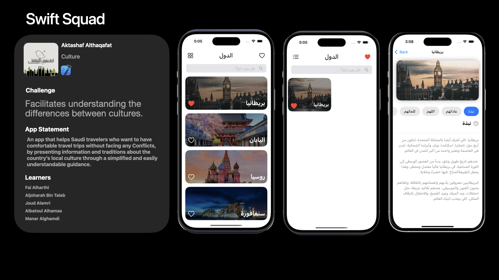

# Aktashef
An app that helps Saudi travelers who want to have comfortable travel trips without facing any Conflicts, by presenting information and traditions about the country’s local culture through a simplified and easily understandable guidance.

# 🌍 Aktashef Althaqafat - اكتشف الثقافات

**Aktashef Althaqafat** is a mobile application developed for Saudi travelers who want to deepen their understanding of local cultures around the world. The app provides offline access to essential cultural guidelines to help users avoid conflicts and better respect customs while traveling.

---

## 🧠 Problem / Opportunity

**Saudi travelers** often wish to avoid unintentional cultural missteps when visiting other countries. Without accessible cultural context, misunderstandings can happen.

---

## ✅ Solution

A comprehensive **offline travel guide app** that provides cultural insights, do’s and don’ts, and social norms about each country in a **simple, friendly, and Arabic-first interface**.

---

## 📱 Features

- 🌍 Browse a list of countries (UK, Japan, Russia, Singapore...)
- 📌 Save favorite countries for quick access
- 📷 View cultural information with visuals and localized Arabic text
- 🚫 Learn what to do and what to avoid in each culture
- 📴 Fully functional **offline** – no internet required

---

## 🛠 Technologies Used

- **SwiftUI** – for building the entire user interface
- **Arabic language** – full localization
- **Custom illustrations and layout** – for a friendly and educational UX

---

## 📸 App Screens

---

## 👩🏻‍💻 Team Members

Developed as a collaborative project by:
- **Fai Alharthi** – [GitHub](https://github.com/FaiAlharthi)
- **Aljoharah Bin Taleb** – [GitHub](https://github.com/Aljoharah25)
- **Joud Alamri** – [GitHub](https://github.com/joudy003)
- **Albatoul Alhamas** – [GitHub](https://github.com/batoul252)
- **Manar Alghamdi** – [GitHub](https://github.com/ManarAliAlghamdi)

Made by the **Swift Squad**

